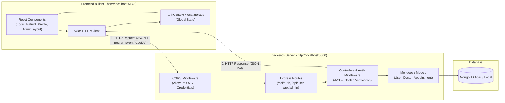

# Full-Stack Web Architecture: Frontend-Backend Connection, Axios vs. CORS, and Credentials Handshake

## Reframed Questions & Concepts

> 1. **How are the React Frontend (Vite) and Node.js Backend (Express + MongoDB) connected in modern full-stack web applications?**
> 2. **What are the technical and architectural differences between Axios and CORS?**
> 3. **What is `withCredentials`? Is it an in-built browser/library standard or a user-defined custom property?**
> 4. **How do frontend `withCredentials: true` and backend CORS `credentials: true` interact during cross-origin authentication?**
> 5. **Which core web standards (MDN / W3C / GFG) govern these concepts?**

---

## 1. How Frontend & Backend Connect: Architecture & Lifecycle



### The 4 Core Connection Pillars

1. **Port & Origin Separation:**
   * **Frontend:** Runs locally on Vite Dev Server at `http://localhost:5173`.
   * **Backend:** Runs locally on Express / Node.js at `http://localhost:5000`.

2. **CORS (Cross-Origin Resource Sharing) Authorization:**
   * In [`backend/server.js`](file:///f:/Web_D/Projects/Hospital_and%20clinical_management1/backend/server.js#L20-L26), the server whitelist instructs the browser that React on port 5173 is permitted to communicate with port 5000:
     ```javascript
     app.use(cors({
         origin: 'http://localhost:5173',
         credentials: true,
     }));
     app.use(express.json());
     app.use(cookieParser());
     ```

3. **HTTP Client Requests (Axios):**
   * React components trigger asynchronous network calls (`GET`, `POST`, `PUT`, `DELETE`) across the network bridge:
     ```javascript
     const { data } = await axios.post('http://localhost:5000/api/auth/login', payload);
     ```

4. **Security & Session Tokens (JWT & Cookies):**
   * Auth tokens received from login are stored and transmitted back in subsequent requests via HTTP headers (`Authorization: Bearer <token>`) or `withCredentials: true` cookies.

---

## 2. Technical Differences: Axios vs. CORS

| Feature | **Axios** | **CORS (Cross-Origin Resource Sharing)** |
| :--- | :--- | :--- |
| **What is it?** | A JavaScript **HTTP Client library** (Promise-based tool). | A **Browser Security Protocol / Specification**. |
| **Where does it run?** | Inside your frontend code (Client-side / Browser / Node.js). | Enforced by the **Web Browser engine** (Chrome, Edge, Safari) using HTTP headers sent by the **Backend**. |
| **Primary Responsibility** | **Sends** HTTP requests and **receives** responses with automatic JSON serialization. | **Enforces security rules** deciding whether a site at origin A can read data from origin B. |
| **Analogy** | The **delivery courier vehicle** carrying data between two houses. | The **security checkpoint / border guard** inspecting if house A has permission to visit house B. |

---

## 3. What is `withCredentials`? Built-in vs Custom

**It is 100% IN-BUILT into native Web Standards (W3C / WHATWG Specifications).**

1. **Native Browser Web API (`XMLHttpRequest`):**
   ```javascript
   const xhr = new XMLHttpRequest();
   xhr.withCredentials = true; // Built directly into all browser JavaScript engines
   ```
2. **Native Fetch API:**
   ```javascript
   fetch('http://localhost:5000/api/user/profile', {
       credentials: 'include' // The fetch API equivalent
   });
   ```
3. **Axios In-Built Config Option:**
   Axios is a wrapper around the browser's `XMLHttpRequest`. Specifying `withCredentials: true` instructs Axios to toggle the underlying browser property.

### What Does `withCredentials: true` Do?
* **By default (`false`):** For security, web browsers automatically **strip out** all sensitive cookies, HTTP session tokens, and TLS authorization certificates from cross-origin requests.
* **When enabled (`true`):** Instructs the browser: *"Attach HTTP-only cookies and authentication credentials along with this cross-origin request."*

---

## 4. `withCredentials` vs `credentials` (The Two-Way Handshake)

They are **not** unrelated concepts; they are the **Client side** and **Server side** of the exact same security handshake.

```
[FRONTEND - Axios / React]                       [BACKEND - Express / Node]
       withCredentials: true           🤝            credentials: true
   "Main cookie bhej raha hoon"                   "Main cookie accept karta hoon"
```

```javascript
// 1. FRONTEND REQUEST (Patient_Profile.jsx)
const config = {
    withCredentials: true, // Client requests browser to attach session cookies
};
await axios.get('http://localhost:5000/api/user/profile', config);
```

```javascript
// 2. BACKEND RESPONSE HEADER (server.js)
app.use(cors({
    origin: 'http://localhost:5173',
    credentials: true, // Server sets response header: Access-Control-Allow-Credentials: true
}));
```

> [!IMPORTANT]
> **Strict CORS Rule:** When `credentials: true` is used, the backend **cannot** use wildcard origin `origin: '*'`. A specific origin (e.g. `'http://localhost:5173'`) must be provided, otherwise the browser will reject the response for security reasons.

---

## 5. Domain Categories & Official References

### Web Engineering Subject Domains
1. **CORS (Cross-Origin Resource Sharing) Specification**
2. **HTTP Headers & Web Security (`Access-Control-Allow-Credentials`)**
3. **Session & Cookie-Based Authentication in Cross-Origin MERN Architectures**

### Official Learning & Documentation Queries
* **MDN Web Docs (Mozilla):**
  * `MDN CORS with credentials`
  * `MDN Access-Control-Allow-Credentials`
  * `MDN XMLHttpRequest.withCredentials`
* **GeeksforGeeks / Dev.to:**
  * `GeeksforGeeks How to use CORS in Node.js with credentials`
  * `Handling Cookies in MERN Stack using withCredentials`
  * `Axios withCredentials and Express CORS explained`

---

## 6. Complete Conversational History & Dialogue

### Query 1:
> **User:** *"Explain frontend and backend are connected."*
>
> **Explanation:** Detailed the port separation (`localhost:5173` vs `localhost:5000`), CORS middleware configuration in `server.js`, Axios client request flow, and MongoDB controller interaction cycle with an architectural diagram.

---

### Query 2:
> **User:** *"okay what are techincal difference between axios and cors. What is withCredentials, this is inbuilt thing or i just made it."*
>
> **Explanation:**
> * Clarified that **Axios** is a client-side HTTP request library, while **CORS** is a browser security mechanism.
> * Confirmed `withCredentials` is a 100% **in-built web standard** (`XMLHttpRequest.withCredentials` / `fetch credentials: 'include'`) used to transmit cookies across different origins.

---

### Query 3:
> **User:** *"credentials and withcredentials are 2 different things. And yeh topic kiske andar aata hai koi article hai gfg google mae?"*
>
> **Explanation:**
> * Explained that `withCredentials: true` (Frontend) and `credentials: true` (Backend) are two sides of the same handshake to set the `Access-Control-Allow-Credentials: true` HTTP response header.
> * Provided exact search queries for MDN Web Docs and GeeksforGeeks articles covering CORS with credentials in Node.js and React.
